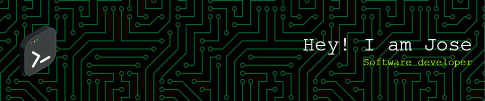

##   Hi there! 👋 I'm Jose 

Soy un apasionado desarrollador frontend en constante búsqueda de soluciones creativas. Mi enfoque principal es crear experiencias web atractivas y accesibles.

## Tecnologias 💻

## Las estadisticas del repositorio
 

## Proyectos Destacados
- [Proyecto 1](enlace al repositorio): Breve descripción.
- [Proyecto 2](enlace al repositorio): Breve descripción.

## Ultimos projectos
Actualmente, estoy explorando Astro. Siempre abierto a nuevas oportunidades de aprendizaje y colaboración.

## Contacto
- LinkedIn: [https://www.linkedin.com/in/jose-vilches-sanchez/]
- Correo electrónico: [vilchessanchezjose@gmail.com]

¡Conéctate conmigo para discutir sobre desarrollo web y tecnología!
